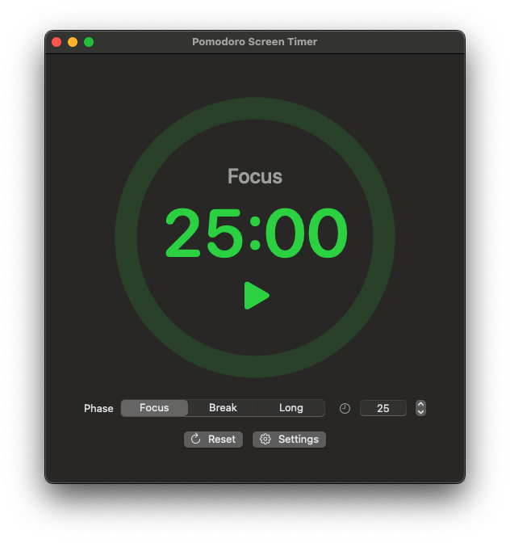
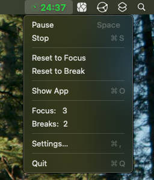
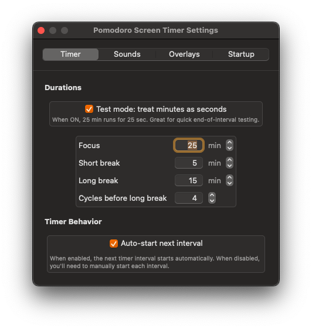

# Pomodoro Screen Timer

A beautiful, native macOS Pomodoro timer that lives in your menu bar and helps you stay focused with customizable work and break sessions. The main feature of this pomodoro timer is that it creates a **visual disruption** for those who have become deaf to the monotony of alarms. The entire screen of all connected monitors will display an overlay to disrupt your current work.

## Features

### Core Functionality
- **Menu Bar Integration**: Runs as a menu bar app with live timer display.
- **Three Phase System**: Focus sessions, short breaks, and long breaks.
- **Customizable Timers**: Set custom durations for each phase (1-360 minutes).
- **Visual Progress Ring**: Modern circular progress indicator with phase-specific colors.
- **Auto-Cycling**: Automatically transitions between focus and break sessions.
- **Manual Control**: Option to manually start each session.

### Visual & Audio
- **Multi-monitor Full-Scrren Overlays**: Customizable break and focus overlays with images to visually disrupt your current work to signal a transition to a break or focus session.
- **Phase-Specific Colors**: 🟢 Green for focus, 🔴 Red for breaks.
- **Custom Sounds**: Set different alarm sounds for focus and break transitions.

### Customization
- **Flexible Timing**: Adjustable focus (default 25min), short break (5min), and long break (15min) durations.
- **Long Break Cycles**: Configure how many focus sessions before a long break.
- **Overlay Customization**: Custom images, colors, and display durations for notification overlays.
- **Sound Options**: Choose from system sounds or custom audio files.
- **Startup Options**: Launch at login.

### Developer Features
- **Debug Mode**: Treat minutes as seconds for faster testing.
- **Clean Architecture**: Well-organized codebase with separate models, views, and controllers.
- **SwiftUI + AppKit**: Modern SwiftUI interface with AppKit integration for menu bar functionality.

## Screenshots
[](./docs/demo/demo.mp4)





## Requirements

- **macOS**: 13.0 (Ventura) or later.
- **Xcode**: 15.0 or later (for building from source).
- **Swift**: 5.9 or later.

## Installation

### Option 1: Build from Source

1. **Clone the repository**:
   ```bash
   git clone <repository-url>
   cd "Pomodoro Screen Timer"
   ```

2. **Build and run using the provided script**:
   ```bash
   chmod +x build_and_run.sh
   ./build_and_run.sh
   ```

3. **Or build manually with Xcode**:
   - Open `Pomodoro Screen Timer.xcodeproj` in Xcode.
   - Select the "Pomodoro Screen Timer" scheme.
   - Build and run (⌘R).

### Build Script Options

The included `build_and_run.sh` script provides several convenient options:

```bash
./build_and_run.sh                # Build (Debug) and run (default)
./build_and_run.sh build          # Build Debug configuration only
./build_and_run.sh release        # Build Release configuration
./build_and_run.sh run            # Run previously built app
./build_and_run.sh clean          # Clean build directory
./build_and_run.sh release-and-run # Build Release and run
```

## Usage

### Getting Started

1. **Launch the app** - It will appear in your menu bar with a timer display.
2. **Click the menu bar icon** to access controls and see the current session.
3. **Open the main window** from the menu to access full controls and settings.

### Basic Operation

1. **Set your timer**: Choose Focus, Short Break, or Long Break from the phase selector.
2. **Adjust duration**: Use the time input field or stepper controls (1-360 minutes).
3. **Start the session**: Click the play button in the progress ring or use menu controls.
4. **Monitor progress**: Watch the progress ring fill and the menu bar countdown.
5. **Session transitions**: The app will automatically notify you and transition between phases.

### Customization

Access **Settings** from the main window or menu to customize:

- **Timer Tab**: Default durations, auto-cycling, and long break frequency.
- **Sounds Tab**: Custom alarm sounds for focus and break transitions.
- **Overlays Tab**: Full-screen overlay appearance and behavior.
- **Startup Tab**: Launch at login and other startup preferences.

### Menu Bar Controls

The menu bar provides quick access to:
- Current session time and phase.
- Start/Stop/Reset controls.
- Phase switching.
- Settings and main window access.

## Architecture

The app follows a clean, modular architecture:

```
Models/
├── Phase.swift          # Phase enum with colors and properties
├── TimerModel.swift     # Core timer logic and state management
├── SettingsStore.swift  # User preferences and configuration
└── AlarmPlayer.swift    # Audio playback for notifications

Views/
├── MainView.swift       # Main timer interface
├── SettingsView.swift   # Settings configuration
├── ProgressRingView.swift # Circular progress indicator
├── OverlayView.swift    # Full-screen overlays
└── MenuBar/             # Menu bar components

Controllers/
└── OverlayController.swift # Overlay logic

Utils/
├── AppLifecycle.swift   # App lifecycle managemen
└── Various helpers      # File selection, system integration
```

### Key Components

- **Phase Model**: Centralized phase management with consistent colors and properties.
- **Timer Model**: Observable timer state with automatic phase transitions.
- **Settings Store**: Persistent user preferences with real-time updates.
- **Overlay System**: Unified full-screen overlay management.
- **Menu Bar Integration**: Native macOS menu bar with live updates.

## Development

### Debug Features

The app includes developer-friendly features:

- **Debug Timer Mode**: Set `devTreatMinutesAsSeconds` to treat minutes as seconds for faster testing.
- **Comprehensive Logging**: Timer state changes and phase transitions are logged.
- **Clean Build Script**: Handles code signing and build issues automatically.

### Code Organization

The codebase follows Swift and SwiftUI best practices:

- **ObservableObject** pattern for state management.
- **Environment objects** for dependency injection.
- **Combine** framework for reactive updates.
- **Separation of concerns** between models, views, and controllers.

## Contributing

Contributions are welcome! Please feel free to submit issues, feature requests, or pull requests.

### Development Setup

1. Fork the repository
2. Create a feature branch
3. Make your changes
4. Test thoroughly (use debug mode for faster iteration)
5. Submit a pull request

## License

This project is available under the GNU General Public License. See the LICENSE file for more details.

## Acknowledgments

- Built with SwiftUI and AppKit for native macOS integration.
- Inspired by the Pomodoro Technique® by Francesco Cirillo.
- Uses native macOS design patterns and user interface guidelines.

---

**Note**: This is a native macOS application that requires macOS 13.0 or later. The app is designed to be lightweight and unobtrusive while providing powerful customization options for productivity enthusiasts.
