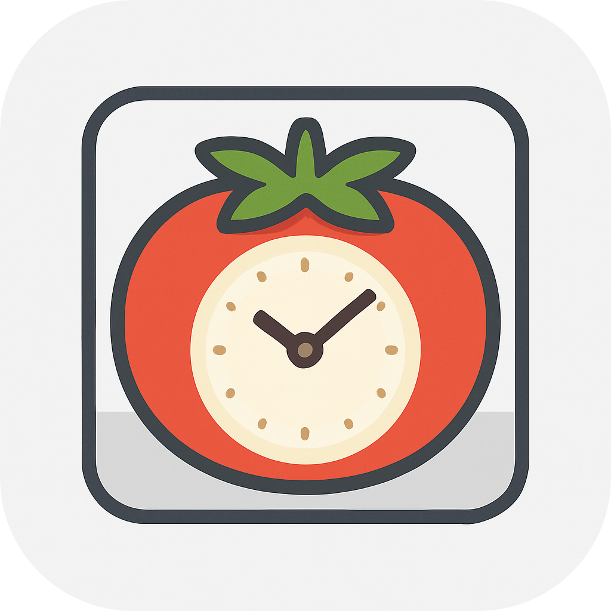
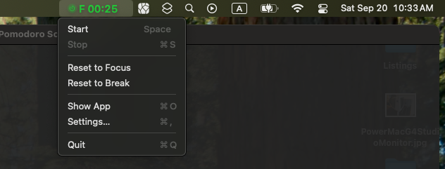

<p align="center">
  
</p>

<h1 align="center">Pomodoro Screen Timer</h1>

<p align="center">
  ⏳ A beautiful, native macOS Pomodoro timer with full-screen visual disruptions
</p>
The main feature of this pomodoro timer is that it creates a **visual disruption** for those who have become deaf to the monotony of alarms. All monitors will display an overlay to disrupt your current work.

## Table of Contents
- [Screenshots](#screenshots)
- [Demo](#demo)
- [Features](#features)
- [Installation](#installation)
- [Usage](#usage)
- [Architecture](#architecture)
- [Development](#development)
- [License](#license)


## Screenshots
<p align="center">
  <br/>
  <br/>
  <br/>
  <br/>
  <br/>
  
</p>


## Demo
<p align="center">
<video src="./docs/demo/demo.mp4" width="720" controls></video>
</p>

## Features

### Core Functionality
- **Menu Bar Integration**: Runs as a menu bar app with live timer display.
- **Three Phase System**: Focus sessions, short breaks, and long breaks.
- **Customizable Timers**: Set custom durations for each phase (1-360 minutes).
- **Visual Progress Ring**: Modern circular progress indicator with phase-specific colors.
- **Auto-Cycling**: Automatically transitions between focus and break sessions.
- **Manual Control**: Option to manually start each session.
- **Cycle Count Tracking**: Displays the number of focus and break sessions since the app has been up.

### Visual & Audio
- **Multi-monitor Full-Screen Overlays**: Customizable break and focus overlays with images to visually disrupt your current work to signal a transition to a break or focus session.
- **Phase-Specific Colors**: 🟢 Green for focus, 🔴 Red for breaks.
- **Custom Sounds**: Set different alarm sounds for focus and break transitions.
- **Voice Alert**: Voice alerts via speaking the message on the overlay for focus and break transitions. (optional)

### Customization
- **Flexible Timing**: Adjustable focus (default 25min), short break (5min), and long break (15min) durations.
- **Long Break Cycles**: Configure how many focus sessions before a long break.
- **Overlay Customization**: Custom images, colors, and display durations for notification overlays.
- **Sound Options**: Choose from system sounds or custom audio files.
- **Voice Options**: Choose from system voices to read out the message on the overlay. 
- **Startup Options**: Launch at login.

### Developer Features
- **Debug Mode**: Treat minutes as seconds for faster testing.
- **Clean Architecture**: Well-organized codebase with separate models, views, and controllers.
- **SwiftUI + AppKit**: Modern SwiftUI interface with AppKit integration for menu bar functionality.

## Requirements

- **macOS**: 13.0 (Ventura) or later.
- **Xcode**: 15.0 or later (for building from source).
- **Swift**: 5.9 or later.

## Installation

### Build from Source

1. **Clone the repository**:
   ```bash
   git clone <repository-url>
   cd "Pomodoro Screen Timer"
   ```

2. **Build and run using the provided script**:
   ```bash
   chmod +x scripts/build_and_run.sh
   ./scripts/build_and_run.sh
   ```

    **Or build manually with Xcode**:
   - Open `Pomodoro Screen Timer.xcodeproj` in Xcode.
   - Select the "Pomodoro Screen Timer" scheme.
   - Selet `My Mac` as the target device.
   - Build and run (⌘R).

3. **Copy built app to `/Applications` folder**
   1. Go into the build folder 

        **Via build script**
        - `<project root>/build/Build`.

        **Via Xcode**
       - Go into the build folder via `Product -> Show Build Folder in Finder` in Xcode.

   2. Copy the `"Products/Debug/Pomodoro Screen Timer.app"` or `"Products/Release/Pomodoro Screen Timer.app"` to `/Applications`.


### Build Script Options

The included `build_and_run.sh` script provides several convenient options:

```bash
./build_and_run.sh                # Build (Debug) and run (default)
./build_and_run.sh debug          # Build Debug configuration only
./build_and_run.sh release        # Build Release configuration
./build_and_run.sh run            # Run previously built app
./build_and_run.sh clean          # Clean build directory
./build_and_run.sh release-and-run # Build Release and run
```

## Usage


### Getting Started

1. **Launch the app** - It will appear in your menu bar with a timer display.
2. **Click the menu bar icon** to access controls and see the current session.
3. **Open the main window** from the menu to access full controls and settings.

### Basic Operation

1. **Set your timer**: Choose Focus, Short Break, or Long Break from the phase selector.
2. **Adjust duration**: Use the time input field or stepper controls (1-360 minutes).
3. **Start the session**: Click the play button in the progress ring or use menu controls.
4. **Monitor progress**: Watch the progress ring fill and the menu bar countdown.
5. **Session transitions**: The app will automatically notify you and transition between phases.

### Customization

Access **Settings** from the main window or menu to customize:

- **Timer Tab**: Default durations, auto-cycling, and long break frequency.
- **Sounds Tab**: Custom alarm sounds for focus and break transitions.
- **Overlays Tab**: Full-screen overlay appearance and behavior.
- **Startup Tab**: Launch at login and other startup preferences.

### Menu Bar Controls

The menu bar provides quick access to:
- Current session time and phase.
- Start/Stop/Reset controls.
- Phase switching.
- Settings and main window access.

## Architecture

The app follows a clean, modular architecture:
```
Core
├── AlarmHandle.swift
├── OverlayConfig.swift
├── OverlayController.swift
├── Phase.swift
├── SettingsStore.swift
└── TimerModel.swift

Extensions
└── Comparable+Extensions.swift

Services
├── AlarmPlayer.swift
├── AppLifecycle.swift
├── LoginItemManager.swift
├── Persistence.swift
├── SpeechSynthesizer.swift
└── SystemSounds.swift

Utils
├── FileSelectionHelper.swift
├── OverlayNSWindow.swift
└── WindowBehaviorConfigurator.swift

Views
├── ContentView.swift
├── MainView.swift
├── MenuBar
│   ├── MenuBarStatusLabelView.swift
│   ├── MenuBarView.swift
│   └── StatusImage.swift
├── OverlayView.swift
├── ProgressRingView.swift
└── Settings
    ├── Components
    │   ├── AlarmTestButton.swift
    │   ├── DurationRow.swift
    │   ├── ImagePickerRow.swift
    │   ├── OverlaySection.swift
    │   ├── SettingsGridRow.swift
    │   ├── SoundPickerSection.swift
    │   └── VoicePicker.swift
    ├── SettingsView.swift
    └── Tabs
        ├── OverlaySettingsTab.swift
        ├── SoundSettingsTab.swift
        ├── StartupSettingsTab.swift
        └── TimerSettingsTab.swift
```

### Key Components
- **Phase Model**: Centralized phase management with consistent colors and properties.
- **Timer Model**: Observable timer state with automatic phase transitions.
- **Settings Store**: Persistent user preferences with real-time updates.
- **Overlay System**: Unified full-screen overlay management.
- **Menu Bar Integration**: Native macOS menu bar with live updates.

## Development

### Debug Features

The app includes developer-friendly features:

- **Debug Timer Mode**: Set `devTreatMinutesAsSeconds` to treat minutes as seconds for faster testing.
- **Comprehensive Logging**: Timer state changes and phase transitions are logged.
- **Clean Build Script**: Handles code signing and build issues automatically.

### Code Organization

The codebase follows Swift and SwiftUI best practices:

- **ObservableObject** pattern for state management.
- **Environment objects** for dependency injection.
- **Combine** framework for reactive updates.
- **Separation of concerns** between models, views, and controllers.

## License

This project is available under the GNU General Public License. See the LICENSE file for more details.

## Acknowledgments

- Built with SwiftUI and AppKit for native macOS integration.
- Inspired by the Pomodoro Technique® by Francesco Cirillo.
- Uses native macOS design patterns and user interface guidelines.

---

**Note**: This is a native macOS application that requires macOS 13.0 or later. The app is designed to be lightweight and unobtrusive while providing powerful customization options for productivity enthusiasts.
